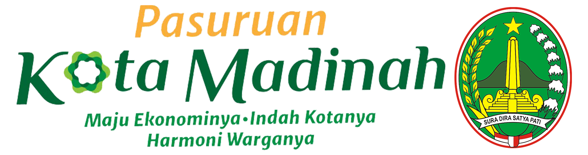

## Dokumen Perencanaan Perangkat Daerah
[Laporan RPJMD](https://bit.ly/RenstraPD_Sosbudpem)

[Laporan RENSTRA](https://bit.ly/RPJMD_KoPas)

[Laporan RENJA](https://bit.ly/RenjaPD_Sosbud2023)

## Pelaporan Dokumen Perencanaan
### `Pelaporan Monev Trivulan III`
* Format laporan dapat diunduh melalui link berikut ini, [Format Laporan](https://bit.ly/Berkas_MonevTBIII)

* Tata cara pengisian dapat dilihat melalui videio dibawah ini


 
* Pengumpulan laporan melalui link berikut ini, [Pengumpulan](https://bit.ly/Pengumpulan_MonevTBIII)

## Program Prioritas Kota Pasuruan 2021 - 2026
### `MAJU EKONOMINYA`
  * **Balapan** (Pembukaan Lapangan Pekerjaan)
  * **Motif** (Penguatan UMKM & Ekonomi Kreatif)
  * **Gembang Giri** (Pengembangan Wisata Terintegrasi)
  * **Tumpuan** (Bantuan Modal Usaha untuk Perempuan Kepala Keluarga)

### `INDAH KOTANYA`
  * **Tutur Ramah** (Infrastruktur & Lingkungan Hidup yang Ramah & Nyaman)

### `HARMONI WARGANYA`
  * **Dik Tias  Lerparas Asih** (Pendidikan Gratis Berkualitas)
  * **Mas Tri** (Kesehatan Gratis Standarisasi Faskes & Percepatan Penanganan Covid-19)
  * **Smart GO** (Digitalisasi Layanan, Pemerintah yang Melayani)
  * **Dahan Padi** (Kemudahan Layanan 1 Pintu Sehari Mesti jadi)
